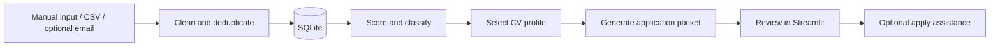

# AI Job Apply Assistant

**Turn scattered job leads into an organised, reviewable application workflow.**

A Python and Streamlit project that imports job opportunities, removes duplicates, explains role fit, selects a CV profile, and builds application documents. SQLite keeps the workflow and its history in one place.

**Portfolio edition · Fictional demo data · No credentials needed for the demo**

## Why this project exists

Job searching involves repeated work: collecting listings, comparing requirements, choosing a relevant CV, and keeping track of applications. This project connects those steps in a single workflow, with explicit statuses and a review trail.

The current implementation uses explainable scoring rules and contextual document templates. Despite the project name, the drafting path does **not** call an LLM. Model-based drafting is a possible extension, not a claimed feature.

## Try the demo

Use Python 3.12. From the repository directory:

```sh
python -m venv .venv
```

Activate it on Windows PowerShell with `.venv\Scripts\Activate.ps1`, or on macOS/Linux with `source .venv/bin/activate`. Then:

```sh
python -m pip install -r requirements-demo.txt
python -m streamlit run demo_app.py
```

For the exact locally tested dependency set, use `requirements-lock.txt` instead of `requirements-demo.txt`.

The demo imports three fictional roles through the real importer, stores them in a temporary SQLite database, and generates a document packet on request. It does not connect to Gmail, fetch job pages, or submit applications. All demo records and generated files are temporary.

For a command-line walkthrough:

```sh
python demo.py
```

Example output from the offline walkthrough:

```text
Business Intelligence Analyst | fit score: 68
Data Engineer | fit score: 70
Workflow Automation Analyst | fit score: 58
PASS: 3 fictional jobs imported, duplicates rejected, packets generated.
```

These scores illustrate the rules; they are not measured application outcomes.

## What to explore

| Capability | Implementation |
| --- | --- |
| Import and deduplication | Normalised URLs and duplicate checks before inserting jobs |
| Explainable ranking | Weighted title, skill, location, and role-family signals |
| CV selection | Match role context against configured static CV profiles |
| Document generation | Contextual cover letters, interview notes, rationale, and checklists |
| Workflow state | SQLite persistence, application statuses, and event records |
| Optional integrations | Gmail OAuth, page enrichment, and browser-based SEEK assistance |
| Regression coverage | Parser fixtures, database states, document rules, and mocked browser flows |

## Architecture



Start with [the architecture notes](docs/ARCHITECTURE.md), [the engineering walkthrough](docs/ENGINEERING.md), or [the integration setup](docs/SETUP.md).

## Verification

**285 tests passed locally** on Windows with Python 3.12.14. See [validation details](docs/VALIDATION.md) for the checks and their limits.

## Run the tests

```sh
python -m pip install -r requirements-lock.txt
python -m unittest discover -s tests -p "test_*.py"
```

GitHub Actions runs the unit suite and offline CLI demo on Windows with Python 3.12. Unit tests do not establish that a live third-party website currently works; external markup and authentication can change.

## Scope and limitations

- This is a personal portfolio project, not a hosted recruiting service or production SaaS.
- Scoring is tuned for Auckland data, BI, and automation roles; it is a heuristic, not a prediction of hiring success.
- Drafts and example profiles need human review. Example accomplishments are fictional, not claims about the author.
- Browser integrations depend on third-party forms and stop for supported authentication or verification blockers.
- The full `run_daily.py` runner can submit eligible applications by default. Use `--prepare-only` when exploring that integration. The standalone demo never invokes it.
- No success-rate, time-saved, or production-scale metrics have been measured for this public edition.

## Repository layout

```text
demo_app.py      Recruiter-friendly, offline Streamlit walkthrough
demo.py          Offline CLI walkthrough using core application modules
app.py           Full application dashboard
src/             Import, scoring, persistence, drafting, and adapters
tests/           Unit and regression tests
examples/        Fictional job listings
data/            Sanitised configuration examples and templates
docs/            Architecture, setup, and engineering notes
```

## Development

See [CONTRIBUTING.md](CONTRIBUTING.md) and the [roadmap](docs/ROADMAP.md). Public history begins with this sanitised portfolio edition; personal operational records and the original private history are excluded.
